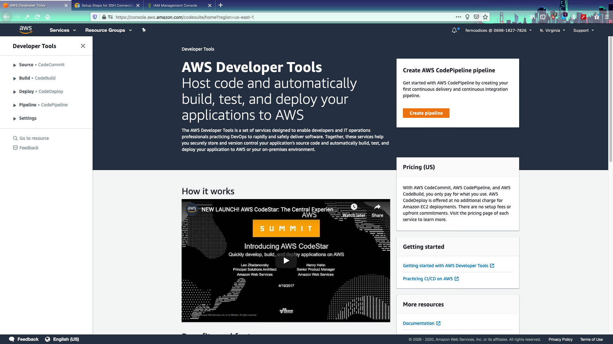
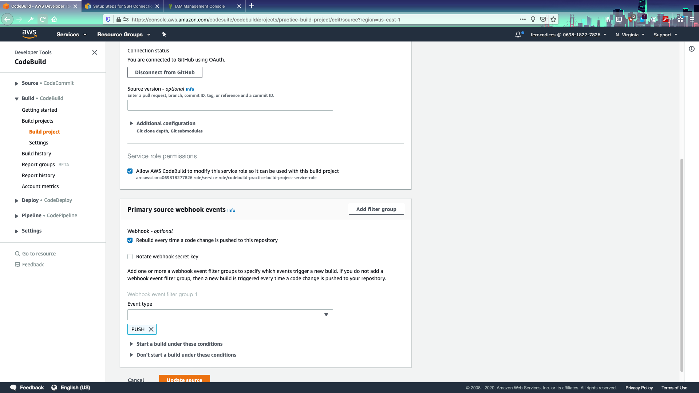
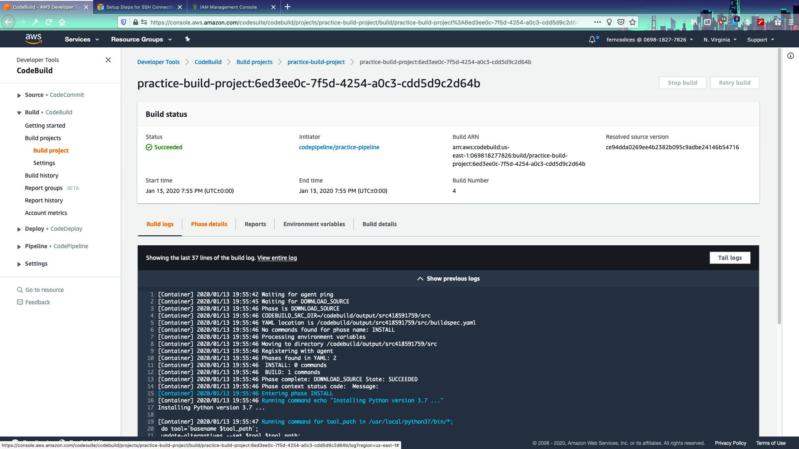

# Creating a development pipeline to run your tests

In this section we're going to be setting up a code-commit repository which is the first step in creating our deployment pipeline! 
SO- the sort of "ideal" way to do this is to run the code-commit directly from an AWS repository. These are available in Developer Tools/SOURCE which is basically Amazon's version of Github:


## Set up a codecommit repository on AWS

1. So first log into the AWS console and do a search for **CodePipeline**
2. Let's start with going off of simple git hooks. Hook up to a public git repository if you have one. IF NOT you can set up a source in CodeCommit



3. Let's walk through setting up a source now. The only tricky part here is really deciding what should trigger a "build". Basically- the standard way to do this is to do a build every time there is a commit or a merge to master. 



4. Okay- so now that we have this set up let's go through how to do a practice build so we can understand the concept. In the root directory of this drive add in a file called `buildspec.yaml`

5. Place this code in the file:

```yaml
version: 0.2

env:
  variables:
    key: "value"
    key: "value"
  #parameter-store:
     # key: "value"
     # key: "value"

phases:
  install:
    runtime-versions:
      python: 3.7
    #commands:
      # - command
      # - command
  #pre_build:
    #commands:
      # - command
      # - command
  build:
    commands:
      - echo Oh Hai Mark
      - sh ./runtests.sh
      # - command
  #post_build:
    #commands:
      # - command
      # - command
#artifacts:
  #files:
    # - location
    # - location
  #discard-paths: yes
  #base-directory: location
#cache:
  #paths:
    # - paths
```

6. Now `git add buildspec.yaml` and run your `git commit -m "testing"` then `git push origin master`



7. NOW...let's run a 